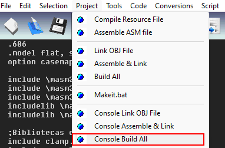

# Assembly Image Filter
This project process an given image by adding one value to a choosed BGR band, using Assembly (MASM32 was my choise). It was used as the final project of Computer Arquiteture class, as requested by
Professor Ewerton Monteiro Salvador, from the Computer Systems Department (DSC) at Federal University of Paraiba (UFPB).

## Project Specification

- Read an string that represents the name of the input bmp image. Example:

        catita.bmp

<p align="center">
 <br>(Figure: input bmp image "catita.bmp")</p>

- Read an string that represents the name of the output bmp image. Example:

        catita2.bmp

- Enter the BGR band index to change (B=0, G=1, R=2). Example:

        0
 - Enter the amount to add in the band, keeping in mind that color should be in range[0, 255]. Ex:

        50

- For the given inputs above, the following file should be generated:

<p align="center">
 <br>(Figure: bmp image generated "catita2.bmp")</p>

<p align="left">
    (Note: The original pdf file in portuguese can be found at <a href="./res_repository/project-description.pdf">res_repository</a> directory)
</p>

## Solution adopted
- Request inputs
```assembly
call _MyIO_Setup ; setup console handler
call _ReadInputs ; read inputs
```
- Open input image file
```assembly
invoke CreateFile, addr inputImage_name, GENERIC_READ, 0, NULL, OPEN_EXISTING, FILE_ATTRIBUTE_NORMAL, NULL

mov inputImage_fileHandle, eax 
```

- Create ouput image file
```assembly
invoke CreateFile, addr outputImage_name, GENERIC_WRITE, 0, NULL, CREATE_ALWAYS, FILE_ATTRIBUTE_NORMAL, NULL

mov outputImage_fileHandle, eax
```

- Copy first 54 bytes of input image output image (these first 54 bytes are the bmp image header data).
```assembly
call _CopyFirst54Bytes
```

- Iterate color band at the chosen index and add a value for every pixel
```assembly
push DWORD PTR[ebp-12] ; BGR array address
push DWORD PTR[ebp-8] ; color index to change
push DWORD PTR[ebp-4] ; value to add
call _FilterPixel
```

- Clamp pixel's color band to be between 0 and 255
```assembly
push eax
call _Clamp
```

- Write pixel data to output file
```assembly
invoke WriteFile, outputImage_fileHandle, addr bgr_color_buffer, 3, addr outputImage_writeCount
```

## How to run
- Requirements:
    - <a href="https://www.masm32.com/">Assembly Programming Language (MASM32 version)</a>
    - MASM32 Editor (already installed with masm32 assembly)
- Open <a href="src/main.asm">main.asm</a> using MASM32 Editor. 
- Go to Project -> Console Build All (Two files will be generated, main.exe and main.obj).

<p align="center"> </p>

- Open cmd at the project folder and enter _main.exe_
- Enter the input bmp image file name
- Enter the output bmp image file name
- Enter the BRG band index to change
- Enter the value to add in this chosen BGR band
- The output will be a processed bmp image with the output name inserted.

## Outputs generateds
    input values:
        input image: catita.bmp
        output image: catitab.bmp
        index to change: 0
        value to add: 50 
    output image:

<p align="center">
 <br>(Figure: bmp image generated "catitab.bmp")</p>

    input values:
        input image: catita.bmp
        output image: catitag.bmp
        index to change: 1
        value to add: 50 
    output image:

<p align="center">
 <br>(Figure: bmp image generated "catitag.bmp")</p>

    input values:
        input image: catita.bmp
        output image: catitar.bmp
        index to change: 2
        value to add: 50 
    output image:

<p align="center">
 <br>(Figure: bmp image generated "catitar.bmp")</p>

## Authors
 - [@Diego Reis](https://www.github.com/diegolrs)
